## Introduction

This documentation outlines the steps to set up and utilize a Network Penetration Testing lab for practice and skill enhancement. The lab will simulate a real-world network environment to test various penetration testing techniques and tools.

## Objectives

- To simulate real-world network environments for penetration testing.
- To identify and exploit vulnerabilities within the network.
- To develop skills in cybersecurity defense mechanisms.

## Prerequisites

- **Hardware**: A computer with at least 8 GB of RAM and 100 GB of free disk space.
- **Software**: Virtualization software (e.g; VirtualBox), Operating system ISOs (e.g; Kali Linux, Metasploitable 2, Windows 10).

## Methodology
**Tools and Techniques**

- **Kali Linux**: The primary operating system used for penetration testing.
- **Metasploit**: A tool for developing and executing exploit code against a remote target machine.
- **Nessus**: A vulnerability scanner used to identify known vulnerabilities in the network.
- **Nmap**: A network scanning tool used to discover hosts and services on a network.
- **Metasploitable 2**: A deliberately vulnerable Linux virtual machine used as a target for testing.
- **Windows 10**: A standard operating system used as a target for testing.

## Lab Setup

### 🖥️ Step 1: Set Up Virtualization Environment

1. **Download and Install Virtualization Software**:
- *VirtualBox*: [Download VirtualBox](https://www.virtualbox.org/)

2. **Download Operating System ISOs**:
- *Kali Linux*: [Download Kali Linux](https://www.kali.org/)
- *Metasploitable 2*: [Download Metasploitable 2](https://sourceforge.net/projects/metasploitable2/)

### 🖥️ Step 2: Create and Configure Virtual Machines (VMs)

1. **Create a Kali Linux VM**:
- Open the virtualization software and create a new VM.
- Configure the VM with at least 2 GB of RAM and 20 GB of disk space.
- Attach the Kali Linux ISO to the VM and complete the installation process.

*Ref 1: Kali Linux Installation*

2. **Create a Windows 10 VM**:
- Open the virtualization software and create a new VM.
- Configure the VM with at least 2 GB of RAM and 20 GB of disk space.
- Attach the Windows 10 ISO to the VM and complete the installation process.

*Ref 2: Windows 10 Installation*

3. **Create a Metasploitable 2 VM**:
- Create another VM and configure it with similar specifications.
- Attach the Metasploitable 2 ISO and complete the installation.

*Ref 3: Metasploitable 2 Installation*

4. **Network Configuration**:
- Set all the VMs to use "Host-only Adapter" or "NAT Network" mode to ensure they can communicate with each other while remaining isolated from the main network.

### 🖥️ Step 3: Conducting Penetration testing

1. **Information Gathering/Reconnaissance**
- Performed network scanning using Nmap to identify live hosts and open ports.
- Gathered information about services running on the targets.

*Ref 4: Nmap Scan 1*

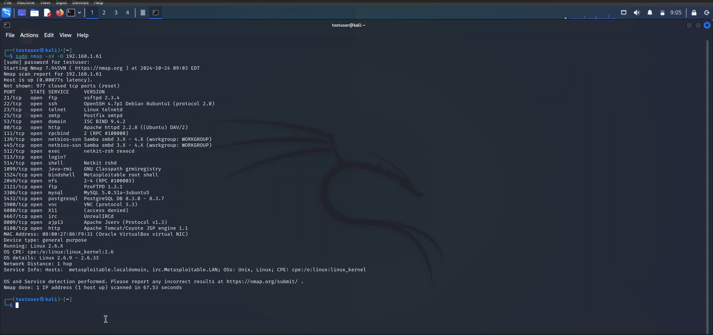

*Ref 5: Nmap Scan 2*

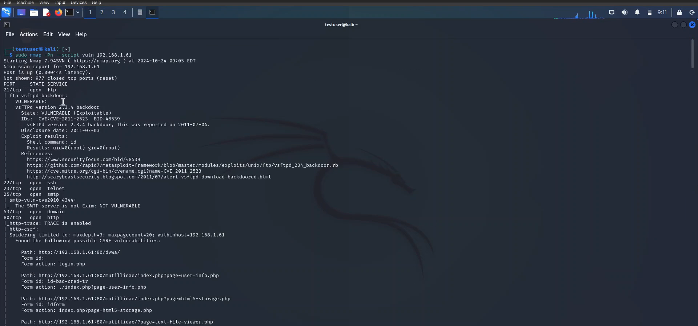

2. **Scanning and Enumeration/Vulnerability Scanning**
- Used vulnerability scanner i.e.; Nessus to detect weaknesses in the network.
- Documented identified vulnerabilities for further analysis.

*Ref 6: Nessus Scan 1*

*Ref 7: Nessus Scan 2*

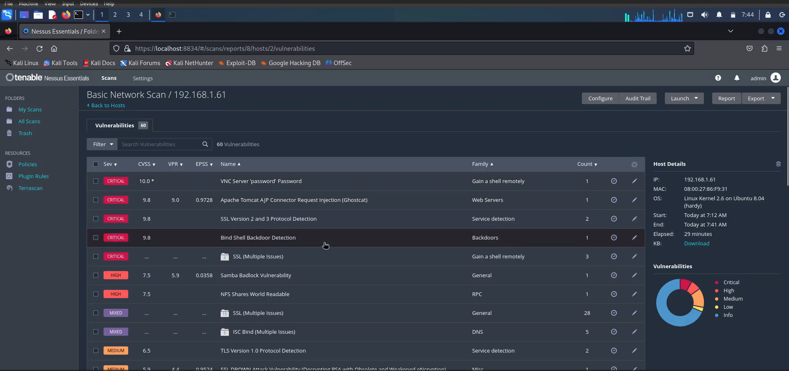

*Ref 8: Nessus Scan 3*

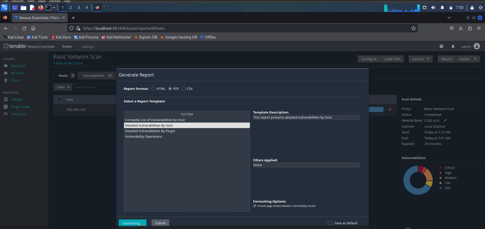

3. **Exploitation**
- Utilized Metasploit Framework & Armitage to exploit discovered vulnerabilities.
- Gained unauthorized access to the target machines.

*Ref 9: Metasploit 1*

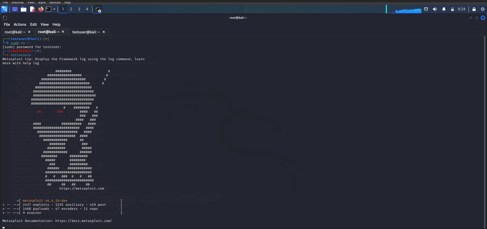

*Ref 10: Metasploit 2*

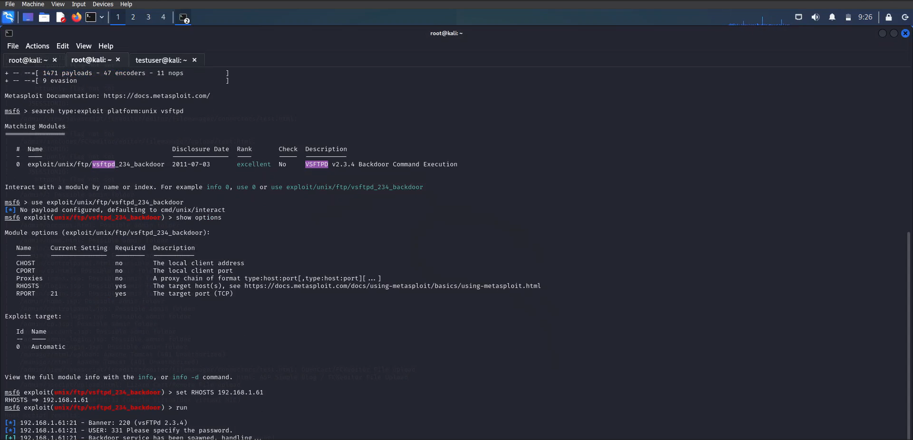

*Ref 11: Metasploit 3*

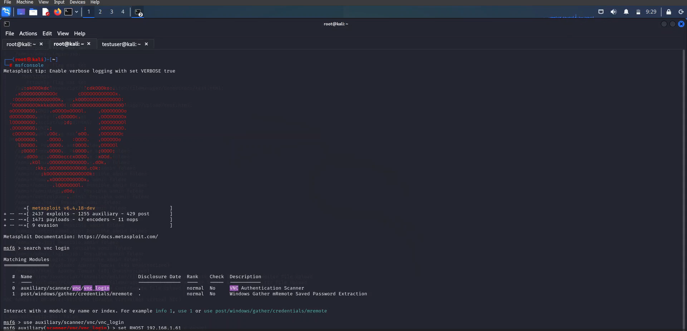

*Ref 12: Metasploit 4*

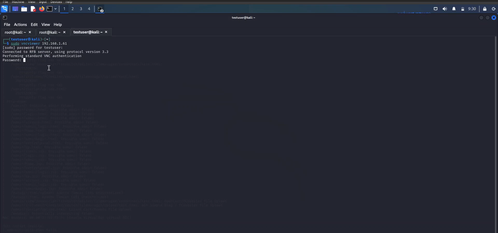

*Ref 13: Metasploit 5*

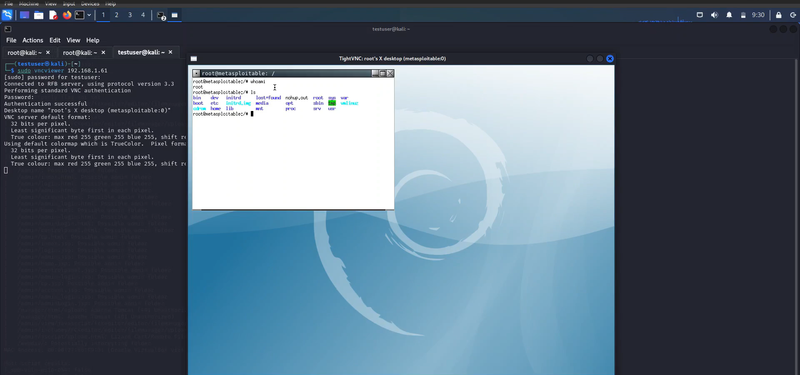

*Ref 14: Armitage 1*

*Ref 15: Armitage 2*

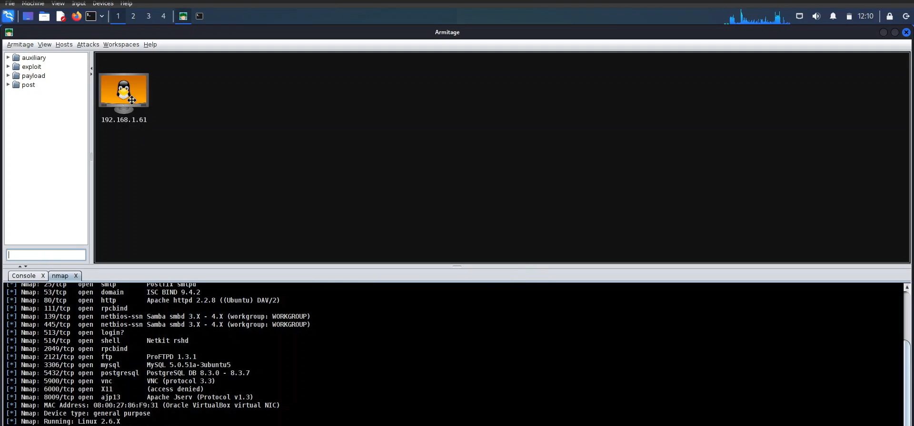

*Ref 16: Armitage 3*

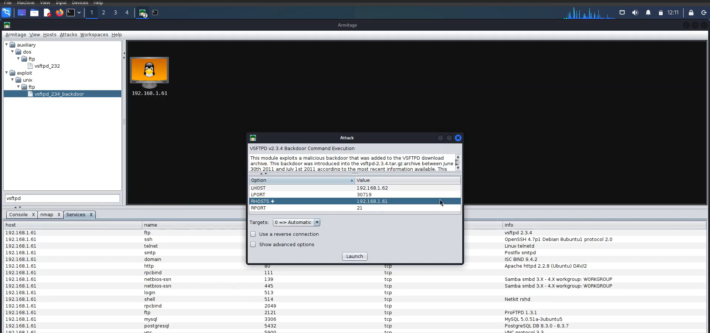

*Ref 17: Armitage 4*

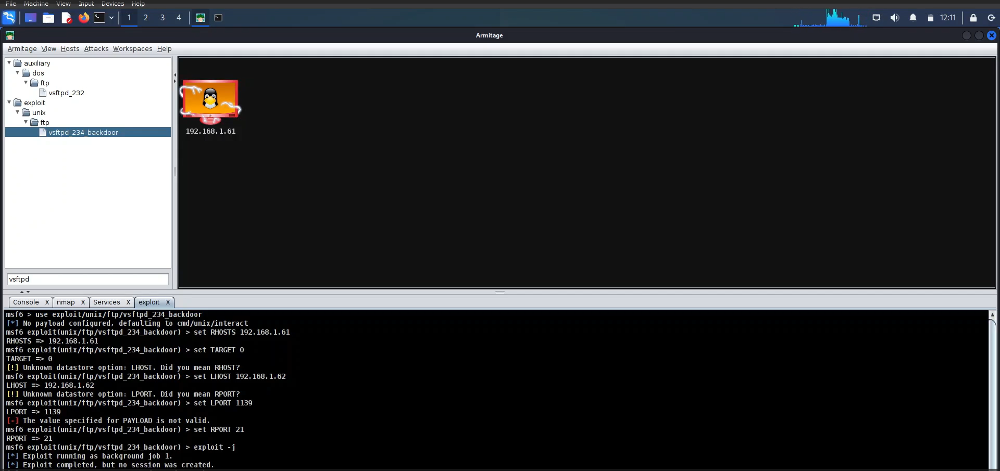

*Ref 18: Msfvenom Payloads*

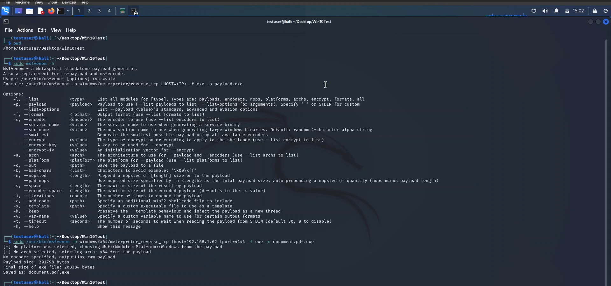

*Ref 19: Exploitation - Windows 10*

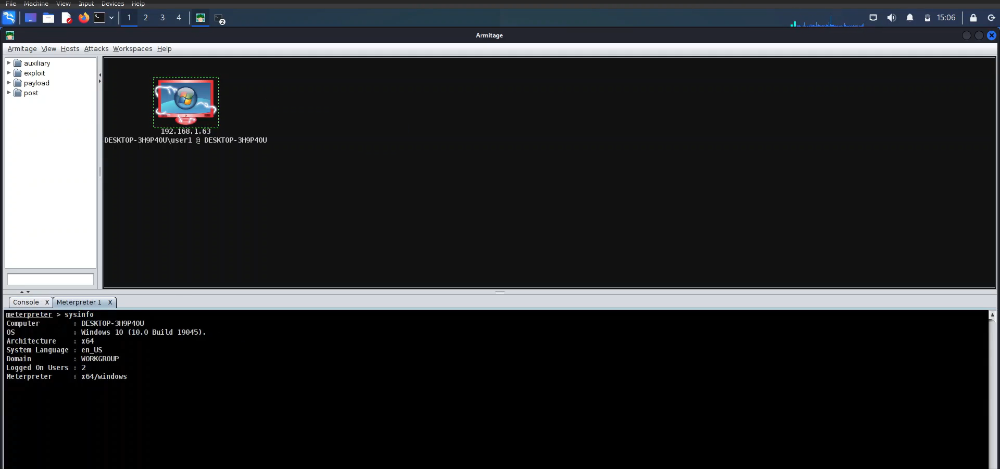

4. **Post-Exploitation**
- Conducted privilege escalation, data exfiltration, and persistence mechanisms.
- Documented all actions taken and outcomes achieved.

*Ref 20: Post-Exploitation - Windows 10 1*

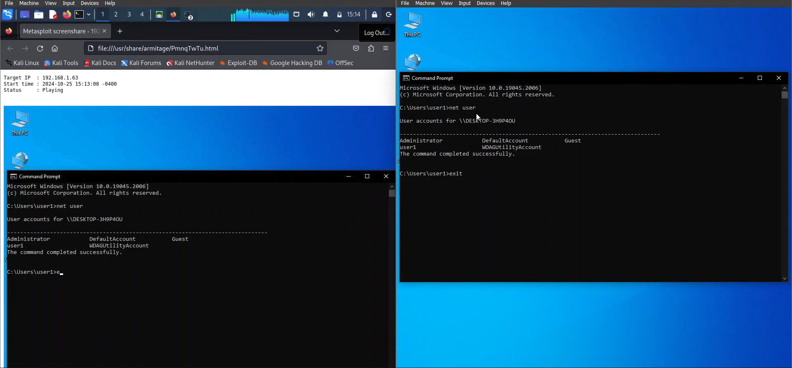

*Ref 21: Post-Exploitation - Windows 10 2*

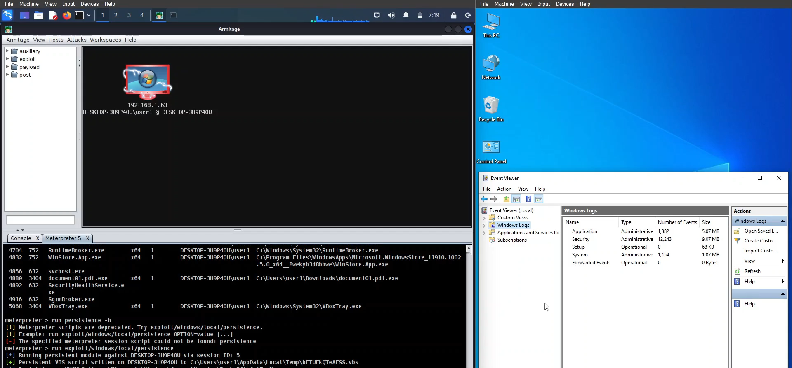

*Ref 22: Post-Exploitation - Windows 10 3*

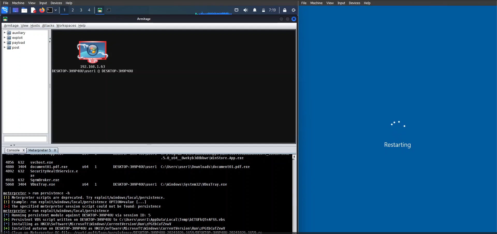

5. 📘 **Reporting**

a. *Findings*:
- The project revealed multiple vulnerabilities, including unpatched software, weak passwords, and misconfigured services.
- Each findings was documented with evidence and categorized based on severity.

b. *Recommendations*:
- Detailed remediation steps were provided for each identified vulnerability, emphasizing the importance of regular patch management, strong password policies, and proper configuration of services.

## Conclusion

This project helped in understanding the critical aspects of network security and provided valuable insights into improving the organization's overall security posture.
